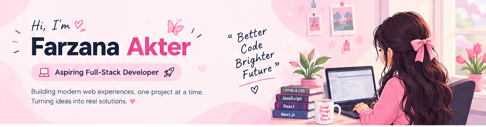

<!-- 🌸 Main Banner -->

 

<!-- ✨ Animated Introduction -->

 

💗 Aspiring Full-Stack Developer   •   Building Web Projects   •   Always Learning

🌷 JavaScript → TypeScript → React → Next.js → Backend → Full-Stack

💕 About Me

<table>
<tr>
<td width="60%" valign="top">

🌸 Hi, I'm Farzana!

I'm an aspiring Full-Stack Developer who enjoys learning, building, experimenting, and improving through real-world projects.

I started with the fundamentals of web development and gradually moved into modern JavaScript technologies. Right now, I'm focusing on React, Next.js, TypeScript, and building complete web experiences.

💗 Learn something → Build something → Break something → Fix it → Grow.

</td>

<td width="40%" valign="top">

🎀 Quick Intro

🌷 Role: Aspiring Full-Stack Developer
💻 Focus: Web Development
⚛️ Currently: React & Next.js
📘 Strengthening: TypeScript
🚀 Goal: Professional Full-Stack Developer
💗 Mindset: Keep learning & building

</td>
</tr>
</table>

🎀 What I'm Doing

💻 Building

📚 Learning

🧩 Practicing

🚀 Growing

Real-world web projects

React & Next.js

Problem solving

Full-Stack skills

Responsive interfaces

TypeScript

API integration

Professional workflow

🎓 My Learning Journey

╭──────────────╮
│  HTML + CSS  │
╰──────┬───────╯
       ↓
╭──────────────╮
│ JavaScript   │
╰──────┬───────╯
       ↓
╭──────────────╮
│ TypeScript   │
╰──────┬───────╯
       ↓
╭──────────────╮
│    React     │
╰──────┬───────╯
       ↓
╭──────────────╮
│   Next.js    │
╰──────┬───────╯
       ↓
╭──────────────╮
│   Backend    │
╰──────┬───────╯
       ↓
╭────────────────────╮
│ 🚀 Full-Stack Dev  │
╰────────────────────╯

🛠️ Tech Stack

🌸 Frontend

🔧 Tools & Platforms

💡 Currently Learning

<table>
<tr>
<td width="50%" valign="top" bgcolor="#FFF4F8">

⚛️ React

💗 Components

💗 Props

💗 State & Hooks

💗 API Integration

💗 Modern UI Development

</td>

<td width="50%" valign="top" bgcolor="#FFF7FB">

▲ Next.js

🌸 App Router

🌸 Routing

🌸 Dynamic Routes

🌸 Data Fetching

🌸 Server & Client Components

🌸 Search Params

🌸 Error & Loading UI

</td>
</tr>
</table>

🌟 Featured Projects

<table>
<tr>

<td width="33%" valign="top" bgcolor="#FFF4F8">

💻 DevStack

A development technology stack selection project built with a focus on reusable React components, TypeScript, and modern UI.

Stack

React TypeScript Tailwind CSS

</td>

<td width="33%" valign="top" bgcolor="#FFF7FB">

🧸 ToyTopiya

A local kids toy store platform designed around a clean, responsive, and user-friendly shopping experience.

Stack

React React Router Tailwind CSS Firebase

</td>

<td width="33%" valign="top" bgcolor="#FFF4F8">

▲ Next.js Learning

A collection of learning projects covering routing, dynamic routes, API fetching, search params, loading states, error handling, and more.

Stack

Next.js TypeScript Tailwind CSS

</td>

</tr>
</table>

📊 GitHub Overview

🔥 Contribution Streak

 

🌸 Keep Going! 💗

More commits • More practice • More progress

🐍 Contribution Journey

<!-- This animation appears after you generate the snake workflow in GitHub Actions -->

🎯 2026 Goals

<table>
<tr>
<td width="50%" valign="top" bgcolor="#FFF4F8">

🌷 Development Goals

⭕ Build more real-world projects

⭕ Master React fundamentals

⭕ Become confident with Next.js

⭕ Strengthen TypeScript

⭕ Learn Backend Development

</td>

<td width="50%" valign="top" bgcolor="#FFF7FB">

🚀 Career Goals

⭕ Build complete Full-Stack applications

⭕ Improve problem-solving skills

⭕ Develop professional workflow

⭕ Build a strong project portfolio

⭕ Prepare for a professional developer role

</td>
</tr>
</table>

🧠 My Development Philosophy

📖 Learn

↓

💻 Build

↓

🐛 Break

↓

🔧 Debug

↓

⚙️ Improve

↓

🔄 Repeat

 

🌸 “Every project is another step forward.”

I believe consistent practice and real-world projects are the best ways to grow as a developer.

🌱 Currently Exploring

💌 Let's Connect

  

💗 Keep Learning • Keep Building • Keep Growing 🚀

Farzana-Akter-Alo ♡

